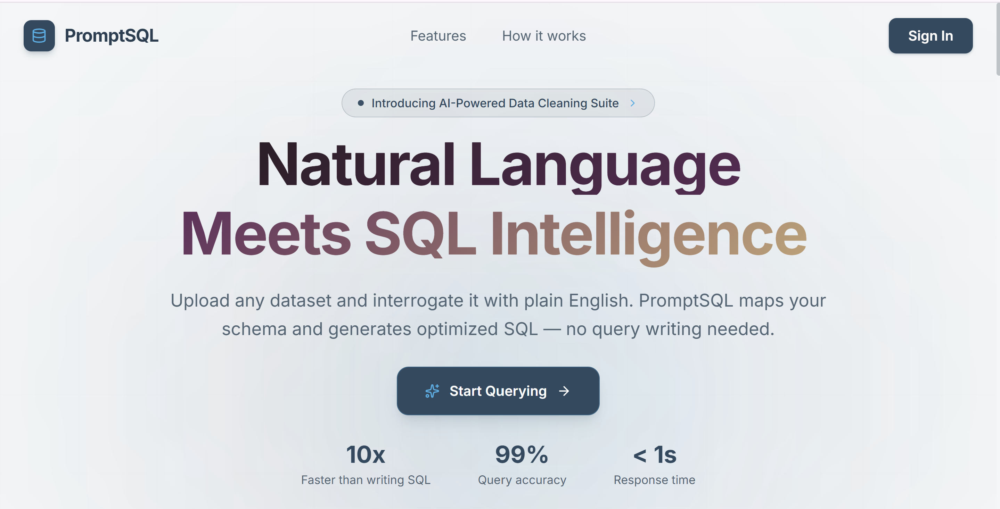
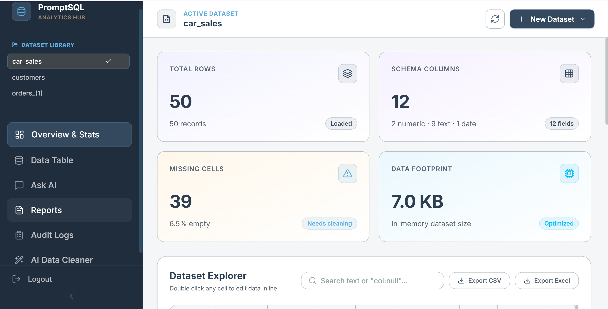
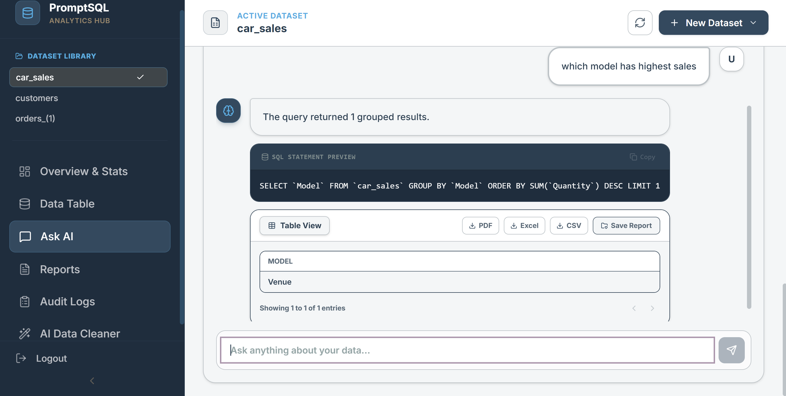

<div align="center">
  
  # 🔮 PromptSQL: AI-Powered Dataset Assistant
  
  [](https://fastapi.tiangolo.com/)
  [](https://react.dev/)
  [](https://www.typescriptlang.org/)
  [](https://www.mysql.com/)
  [](https://groq.com/)

  *An **Natural Language to SQL (NL-to-SQL) analytics console** that bridges the gap between raw datasets and business insights. Upload any CSV or Excel file, and chat with your database directly using natural language. The system automatically creates isolated tables, translates your questions into optimized SQL, executes them safely alongside AI-interpreted summaries.*

  ---

  <br />

<!-- Start of the gallery table -->
<table border="0">
  
  <!-- ROW 1 (First Two Images) -->
  <tr>
    <td align="center">
      
      <br>
    </td>
    <td align="center">
      
      <br>
    </td>
  </tr>

  <!-- ROW 2 (Last Two Images) -->
  <tr>
    <td align="center">
      
      <br>
    </td>
    <td align="center">
      
      <br>
    </td>
  </tr>

</table>
<!-- End of the gallery table -->

  <br />

</div>

---

## 🛠️ Complete Tech Stack

PromptSQL is built using a modern, scalable, and type-safe architecture.

**Frontend (Client-Side)**
* **Core:** React 19 (with TypeScript)
* **Build Tool:** Vite (for fast HMR and optimized production builds)
* **Styling:** Tailwind CSS
* **Routing:** React Router DOM

**Backend (Server-Side)**
* **Framework:** FastAPI (High-performance async Python framework)
* **Server:** Uvicorn (ASGI server)
* **Data Processing:** Pandas (for high-speed statistical calculations and file parsing)
* **Validation & Types:** Pydantic
* **Authentication:** Stateless JWT (JSON Web Tokens) with Bcrypt password hashing
* **AI Integration:** Groq API (Powered by Llama 3 for lightning-fast NL2SQL inference)

**Database & ORM**
* **Engine:** MySQL
* **Driver:** PyMySQL
* **ORM:** SQLAlchemy (Handles schema generation, session orchestration, and query execution safely)

---

## 🚀 Key Features

* **🔑 Secure User Auth**: Multi-tenant Login & Signup system protecting accounts with hashed passwords via **Bcrypt** and sessions secured by stateless **JWT Tokens**.
* **📁 Ingestion & Auto-Cleaning**: Supports CSV and Excel, parses datatypes (Dates, Floats, Strings), and normalizes column headers safely.
* **🔍 Smart ID Detection**: Recognizes numeric codes (such as Salesman IDs, Customer IDs, Zip codes) and marks them as text, preventing meaningless math computations (mean/median) on ID fields.
* **💬 Conversational NL-to-SQL**: Translates questions (e.g. *"Show me the top 5 brands by sales in 2025"*) into native SQL queries with a self-healing error correction loop.
* **🛡️ Natural Modifications with Impact Simulation**: Safely run INSERTS, UPDATES, or DELETES. The backend runs a dry-run estimation first, warns you of the row impact count, and requires manual confirmation before writing.
* **⚡ Natively Fast In-Database Operations**: Grid loading, search queries, and column statistics (Min, Max, Avg, Median) are computed directly in MySQL, resolving memory overload and loading pages in milliseconds.
* **✏️ Interactive Cell Editing**: Manually modify any single table cell value by double-clicking it directly inside the UI explorer grid.
* **📄 Exporters**: Export raw query datasets directly to CSV, Excel, or custom formatted **PDF Reports** complete with natural language AI summaries.
* **🪄 AI Data Cleaning & Preprocessing Suite**: An automated utility designed to handle data deduplication, text standardization, and outlier capping. It repairs datasets effortlessly by isolating unique records, extracting clean numbers, and intelligently imputing missing values using custom constraints or statistical strategies.

---

## 🔮 Future Improvements (Roadmap)

While PromptSQL is highly functional, here are the planned features for future releases to make it an even more powerful workspace:

* 📊 **Auto-Generated Visualizations:** Integrating libraries like `Recharts` or `Chart.js` to automatically generate Bar, Line, and Pie charts directly from the AI-generated SQL results without manual configuration.
* 🔗 **Multi-Table Joins & Schema Mapping:** Upgrading the prompt engine to support multiple uploaded tables simultaneously, allowing users to ask complex questions that require `JOIN` operations across related datasets.
* 🔐 **Role-Based Access Control (RBAC):** Introducing granular team permissions (e.g., "Viewer", "Editor", "Admin") so specific users can query data but are restricted from executing DML/DDL modification queries.

---

## 📋 Prerequisites

Before running the application, make sure you have the following installed on your system:
* **Python 3.8+** (with `pip` and `venv` support)
* **Node.js** (v18.0 or higher)
* **MySQL Server** (Running locally on port `3306` or hosted)

---

## ⚡ Quick Start (1-Click Run)

PromptSQL contains a root-level orchestrator script `run.py` which automates virtual environment creation, dependencies installation (for both backend and frontend), and launches the servers.

Simply run the following in your root terminal:

```bash
python run.py
```

This will:
- Check for Python virtual environment (`venv`) and install missing requirements.
- Execute `npm install` inside the frontend directory.
- Prompt you to choose your run mode:
  1. **Developer Mode**: Concurrently spins up **both** the FastAPI API server (`http://localhost:8000`) and React/Vite development server (`http://localhost:5173`) with live hot-reloading inside a single terminal window.
  2. **Production Mode**: Compiles the frontend assets (`npm run build`) and serves them from a single port on `http://localhost:8000`.

---

## 🐳 Docker Setup (Zero-Installation Run)

If you don't want to install Python, Node.js, or MySQL locally on your machine, you can run the entire stack inside isolated Docker containers.

1. Configure your API credentials inside the root `docker-compose.yml` environment block.
2. Build and launch all services with a single command:

```bash
docker-compose up --build
```

This will automatically pull MySQL, build the FastAPI backend, set up React, and host the live console at **`http://localhost:5173`**.

---

## ⚙️ Environment Configuration

Create a `.env` file in the `/backend` directory. Provide your MySQL credentials, Groq API Key, and a JWT Secret signature key as shown below:

```ini
MYSQL_USER=root
MYSQL_PASSWORD=your_mysql_password
MYSQL_HOST=localhost
MYSQL_PORT=3306
MYSQL_DATABASE=promptsql_db
GROQ_API_KEY=gsk_your_actual_groq_api_key
JWT_SECRET=your_super_secret_jwt_sign_key
```

---

## 🛡️ Database Mutation Safety Protocol

| Stage | Security Layer | Action |
| :--- | :--- | :--- |
| **1. Keyword Scan** | Intent & SQL Validator | Rejects suspicious sub-queries, shell injection characters, or queries targeting core system tables (`query_history`, `audit_logs`, `saved_reports`, `users`). |
| **2. Simulation** | Impact Estimator | Generates a virtual dry-run targeting `SELECT COUNT(*)` on active tables to determine exactly how many entries match the criteria. |
| **3. Verification** | AI Explainer & UI Alert | Generates a descriptive warning explaining exactly how many rows will be altered or deleted. |
| **4. Auditing** | Audit Logs & Transactions | Logs the query, user approving action, status, and outcome. Runs everything transactionally so it rolls back automatically on execution failures. |

---

## 🚀 Want to Improve This Project?

Contributions are always welcome! If you have ideas to improve this project, feel free to:

- 🐛 Report bugs by opening an issue.
- ✨ Suggest new features or enhancements.
- 🔧 Fix bugs and submit a pull request.
- 📖 Improve documentation or code comments.
- ⚡ Optimize performance or refactor the code.

---

<div align="center">


## 🎉 Thank You for Checking Out This Project!


If you found this project helpful:

⭐ **Star this repository**

🍴 **Fork it to build upon it**

</div>
