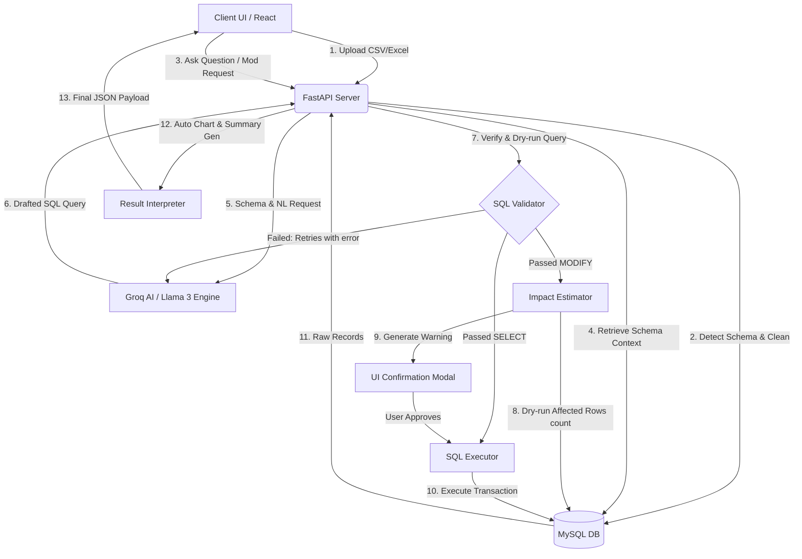

# 🔮 PromptSQL: AI-Powered Dataset Analytics Platform

[](https://fastapi.tiangolo.com/)
[](https://react.dev/)
[](https://www.typescriptlang.org/)
[](https://tailwindcss.com/)
[](https://www.mysql.com/)
[](https://groq.com/)
[](https://www.python.org/)

PromptSQL is an advanced, enterprise-grade **Natural Language to SQL (NL-to-SQL) analytics platform** that bridges the gap between raw datasets and business insights. Upload any CSV or Excel file, and chat with your database directly using natural language. The system automatically creates a clean schema, translates your questions into optimized SQL, executes them safely, and renders beautiful SVG visualizations alongside AI-interpreted summaries.

---

## 🚀 Key Features

### 📁 1. Smart Dataset Ingestion & Auto-Cleaning
- Supports **CSV** and **Excel (.xlsx)** uploads.
- Automatically detects column datatypes (integers, floats, dates, and text categoricals) via a multi-pass scanner.
- Sanitizes table names, normalizes headers, and handles missing/null values seamlessly.

### 💬 2. Conversational NL-to-SQL Engine
- Powered by high-speed **Llama-3 (Groq API)** inference.
- Translates conversational questions (e.g., *"Show me the top 5 clients by revenue in 2025"*) into native SQL queries.
- Dynamically injects context-specific schemas, constraints, and data formats into prompts.

### 🔄 3. Self-Healing SQL Validation Loop
- Automatically parses and validates generated SQL against safety rules (e.g., no cross-table leaks, valid column targets).
- If the database returns a syntax or logic error, the **Auto-Regenerator** executes a self-healing loop (up to 2 retries) to fix the query autonomously before showing it to you.

### 🛡️ 4. NL Database Modification with Impact Analysis
- Safely perform modifications like inserts, updates, deletes, and structural changes through natural language.
- **Safety First:** Prior to execution, the platform runs a dry-run estimation (`SELECT COUNT(*)` version) to determine how many rows will be altered.
- Prompts you with an AI-generated impact warning (e.g., *"Warning: This will delete 245 records from the orders table."*) and requires explicit user confirmation before executing.

### 📈 5. Zero-Dependency Responsive Visualizations
- Auto-detects categorical/numerical variables inside returned results.
- Generates gorgeous, light-weight, highly-responsive SVG charts (Bar & Line charts) natively without bulky external charting packages.
- Dynamically aggregates, sorts, and limits categorical data to render clean, readable distributions.

### 📄 6. Multi-Format Exporters & Saved Reports
- Save your custom dashboard query configurations to view them later.
- Export raw query datasets directly to **CSV**, **Excel**, **HTML**, or formatted **PDF** layouts.

### 🔒 7. Enterprise Audit Logs & Query History
- Every session is fully documented. 
- The **Audit Ledger** logs all interactions, including table creation, NL questions asked, executed queries, and database modifications.

---

## 🏛️ System Architecture

PromptSQL operates on a hybrid architecture combining a high-performance **FastAPI** backend with a modern **React 19 + TypeScript** frontend.



---

## 📂 Project Structure

```
PromptSQL/
├── backend/
│   ├── app/
│   │   ├── database/       # SQLAlchemy Connection & Declarative Base
│   │   ├── models/         # SQLAlchemy Models (AuditLogs, QueryHistory, Reports)
│   │   ├── routes/         # REST API Route Handlers (upload, ask, modification, export...)
│   │   ├── schemas/        # Pydantic Request/Response validation models
│   │   ├── services/       # Core Engines (SQL Gen, Impact Estimator, Data Cleaning...)
│   │   └── main.py         # FastAPI Root Application Setup
│   ├── uploads/            # Temporary storage for uploaded raw datasets
│   ├── requirements.txt    # Python Dependencies
│   └── .env                # Database & API Key Environment Configuration
│
├── frontend/
│   ├── src/
│   │   ├── assets/         # Project logos & structural SVGs
│   │   ├── components/     # Reusable UI Blocks (ChatBox, TablePreview, AuditManager...)
│   │   ├── pages/          # Layout views (LandingPage, UploadPage, DashboardPage)
│   │   ├── services/       # API call connectors (Axios)
│   │   ├── types/          # TypeScript Type Interfaces
│   │   └── main.tsx        # Vite Entry point
│   ├── package.json        # Frontend Dependencies & Build scripts
│   └── tailwind.config.js  # Tailwind CSS Configurations
│
├── run.py                  # Integrated multi-process launcher script
└── README.md               # Visual Documentation
```

---

## 🛠️ Getting Started

### 📋 Prerequisites
Ensure you have the following installed on your system:
- **Python 3.10+**
- **Node.js 18+ & npm**
- **MySQL Server 8.0+**

---

### ⚙️ Environment Configuration

1. Create a `.env` file in the `/backend` directory.
2. Provide your MySQL credentials and Groq API Key as shown below:

```ini
MYSQL_USER=root
MYSQL_PASSWORD=your_mysql_password
MYSQL_HOST=localhost
MYSQL_PORT=3306
MYSQL_DATABASE=promptsql_db
GROQ_API_KEY=gsk_your_actual_groq_api_key
```

> [!NOTE]
> Make sure the database specified in `MYSQL_DATABASE` exists, or the app will attempt to auto-create standard tracking tables when starting.

---

### ⚡ One-Click Startup (Recommended)

PromptSQL contains a root-level orchestrator script `run.py` which automates virtual environment creation, dependencies installation (for both backend and frontend), frontend assets compilation, and launches the server.

Simply run the following in your root terminal:

```powershell
python run.py
```

This will:
- Check for Python virtual environment (`venv`) and install missing requirements.
- Execute `npm install` inside the frontend directory.
- Build static frontend assets (`npm run build`).
- Start the unified FastAPI Server on **`http://127.0.0.1:8000`** serving both the API backend and the static client files.

---

### 🔧 Manual Setup (Developer Mode)

If you'd like to run frontend and backend separately for hot-reloading development environments:

#### 1. Setup Backend
```bash
cd backend
python -m venv venv
# Activate virtual environment
# Windows:
venv\Scripts\activate
# macOS/Linux:
source venv/bin/activate

pip install -r requirements.txt
uvicorn app.main:app --reload --host 127.0.0.1 --port 8000
```

#### 2. Setup Frontend
```bash
cd frontend
npm install
npm run dev
```
The development frontend server will boot up at **`http://localhost:5173`**.

---

## 🛡️ Database & Query Safety Protocol

To ensure your production tables are never corrupted or deleted by accidental inputs, PromptSQL implements a four-tiered security protocol:

| Stage | Security Layer | Action |
| :--- | :--- | :--- |
| **Parsing** | Intent & SQL Validator | Rejects suspicious sub-queries, shell injection characters, or queries targeting application core system tables (`query_history`, `audit_log`, `saved_report`). |
| **Simulation** | Impact Estimator | Generates a virtual dry-run targeting `SELECT COUNT(*)` on active tables to determine exactly how many entries match the criteria. |
| **Verification** | AI Explainer & UI Prompt | Generates a 1-2 sentence descriptive notification warning showing the specific mutation type and rows to be affected. |
| **Auditing** | Audit Logs | Logs the timestamp, SQL query, estimated impact, user approving action, and success outcome of every modification command. |

---

## 🎨 Creative Showcase & Styling
PromptSQL is stylized using a custom warm-gray aesthetic, tailored glassmorphism elements, custom SVG-drawn graphics, smooth interactive transitions, and full responsive design.
- **Glassmorphic panels**: High-contrast subtle borders, light background blurs.
- **Micro-Animations**: Hover-triggered SVG translations, dynamic loading spinners, typing indicator transitions.
- **No external charts**: Tailored interactive canvas-less charts generated via raw React SVG elements, allowing instant loads and custom CSS styles.

---

## 📄 License
This project is licensed under the MIT License. Feel free to copy, modify, and build upon this platform.